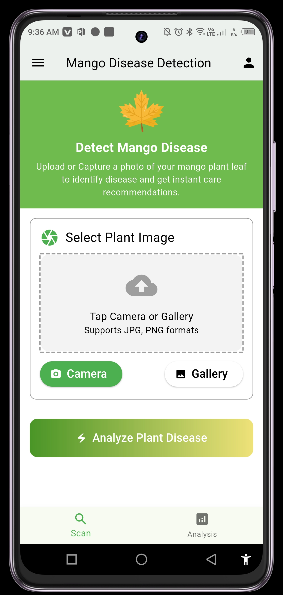
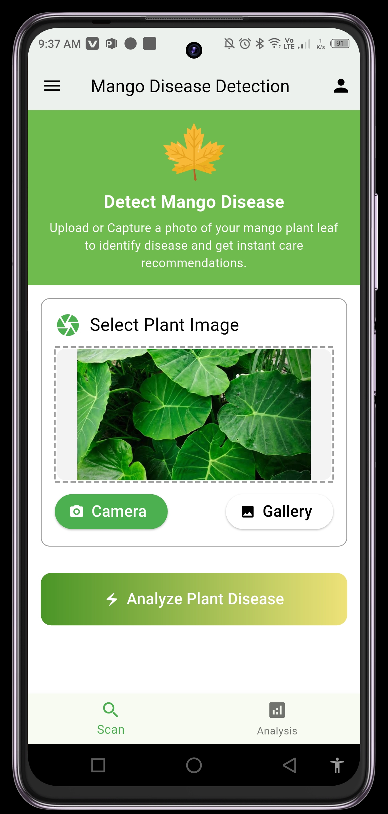
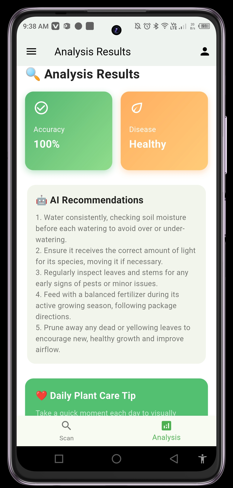

🍃 Mango Disease Detection (Flutter + TFLite + Gemini)

An on-device Flutter application that detects mango leaf diseases using a TensorFlow Lite model (trained via Google Teachable Machine) and leverages Gemini 2.5 Flash to provide practical disease care recommendations and a daily plant-care tip.

📸 Screenshots

✨ Features

✔ On-device inference (fast & private) using flutter_tflite
✔ Image input via Camera or Gallery using image_picker
✔ Modern UI with dotted upload area, gradient buttons, and bottom navigation (Scan / Analysis)
✔ AI Recommendations: Gemini 2.5 Flash provides 5 short, actionable tips for detected disease
✔ Daily Tip: Auto-generated plant-care suggestion
✔ Responsive Layout – images fit properly using ClipRRect + BoxFit.contain

🧪 Dataset & Model

Classes: 8 Mango Leaf Disease Categories

Anthracnose

Powdery Mildew

Sooty Mold

Bacterial Canker

Dieback

Gall Midge

Cutting Weevil

Healthy Leaf

Images per class: ~1,200

Total images: ≈ 9,600

Training: Google Teachable Machine → Export as TFLite

Model Files:

assets/model_unquant.tflite
assets/labels.txt

✅ Ensure labels.txt order matches the model output indices

📱 Tech Stack

Flutter (Dart)

Core Packages:

dependencies:
  flutter:
    sdk: flutter
  image_picker: ^0.8.9
  flutter_tflite: ^1.0.1
  dotted_border: ^3.1.0
  google_generative_ai: ^0.2.2

📂 Project Structure
assets/
  ├── model_unquant.tflite
  ├── labels.txt
  └── leaf.png
lib/
  ├── main.dart
  ├── ai_screen.dart
  └── widgets/ (shared UI components)

Add assets in pubspec.yaml:

flutter:
  uses-material-design: true
  assets:
    - assets/model_unquant.tflite
    - assets/labels.txt
    - assets/leaf.png

🔧 Setup & Installation

1. Clone the Repository

git clone https://github.com/alisraza123/Mango-Disease-Detection.git
cd Mango-Disease-Detection

2. Add Model Files (model_unquant.tflite, labels.txt, leaf.png) under assets/ and register them in pubspec.yaml.

3. Install Dependencies

flutter pub get

4. Update Android Permissions in AndroidManifest.xml:

<uses-permission android:name="android.permission.CAMERA" />
<uses-permission android:name="android.permission.READ_MEDIA_IMAGES" />
<uses-permission android:name="android.permission.READ_EXTERNAL_STORAGE" />

5. Update iOS Permissions in Info.plist:

<key>NSCameraUsageDescription</key>
<string>Need camera to capture plant leaves.</string>
<key>NSPhotoLibraryUsageDescription</key>
<string>Need photo library to pick images of plant leaves.</string>

6. Set Gemini API Key

const String geminiApiKey = String.fromEnvironment('GEMINI_API_KEY');

Run with:

flutter run --dart-define=GEMINI_API_KEY=YOUR_KEY

🚀 Running the App
flutter run

Choose a device/emulator → Tap Scan to capture/pick an image → Tap Analyze → Get results & AI tips.

✅ Testing

Verify real images from camera/gallery

Check predictions vs. known labels

Ensure labels.txt order matches model output

Manual Checklist

 Camera capture works on Android & iOS

 Gallery picker returns valid file path

 TFLite loads without errors

 Analyze button shows spinner

 Confidence & label render after analysis

 Gemini returns 5 bullet tips + daily tip

🤝 Contributing

PRs are welcome! Please open an issue before major changes to ensure consistency with the design and model interfaces.

👤 Author

Ali Raza
📧 alisraza123@gmail.com

“Passionate about AI-powered mobile solutions using Flutter & TensorFlow Lite.”
